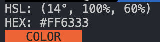

# hsl-to-hex-cli

**hsl-to-hex-cli** is a CLI tool that converts hsl to hex.


## Quick Start

Get **hsl-to-hex-cli** up and running quickly!

1. **Run**:
    ```bash
    npx hsl-to-hex-cli 14 100 60
    ```
2. **Done!**

### Example Output

This will convert the HSL values `(14°, 100%, 60%)` to its HEX equivalent, and display a color preview in your terminal.

- **Input**: `14 100 60`
- **Output**: `HEX: #FF5733`
- **Color Preview**: `COLOR (in the specified color)`



## Contributing

We welcome contributions to **hsl-to-hex-cli**! Whether it's reporting a bug, suggesting an enhancement, or submitting a pull request, your input is valued.

## License

This project is licensed under the MIT License - see the [LICENSE](LICENSE) file for details.

## Contact

For any questions, suggestions, or feedback, please contact [love1ace](mailto:lovelacedud@gmail.com).